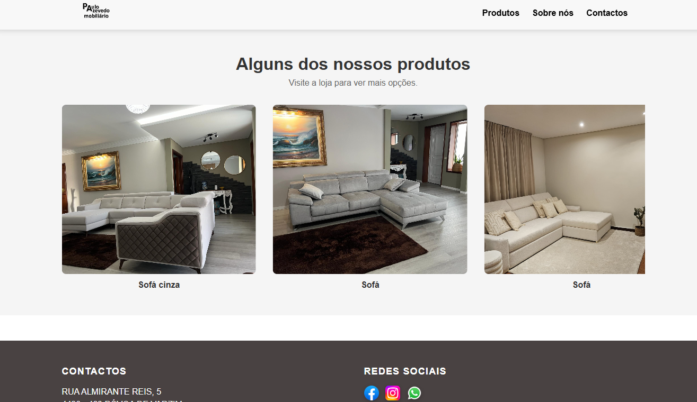
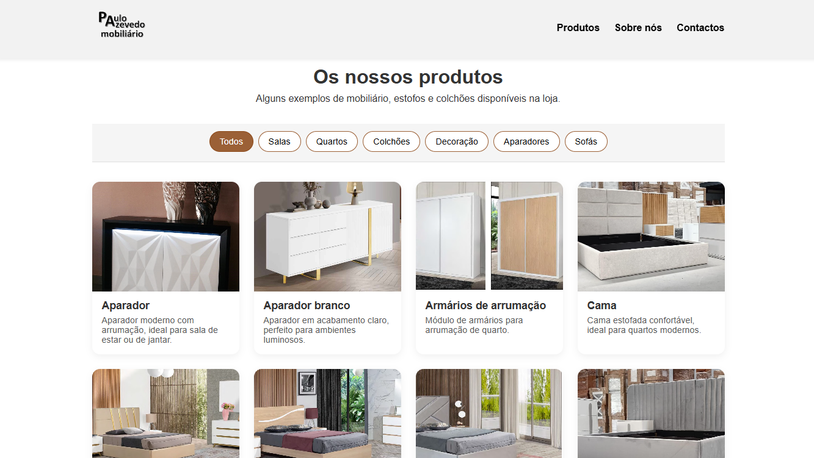
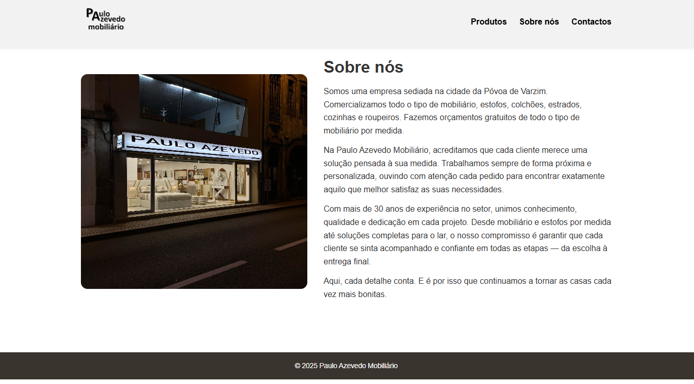
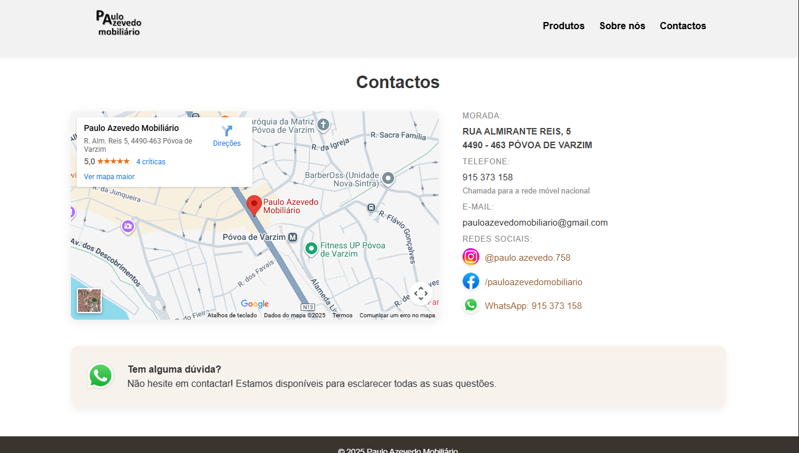

# Paulo Azevedo Mobiliário – Website

A design of website for Paulo Azevedo Mobiliário, a store of mobile and upholstery in Póvoa de Varzim - Portugal.
The task envisage this project was to develop a neat, clean and user-friendly online shop, promoting their goods and ensuring essential store information is available.

**Live Website:**  
https://vascolei.github.io/web-page-paulo-azevedo-mobiliario/

---

## Technologies Used

- **HTML5** – Page structure  
- **CSS3** – Layout, styling and responsiveness  
- **JavaScript** – Lightbox interaction and basic UI behavior  
- **Git & GitHub** – Version control and portfolio hosting  

---

## Project Structure

- **index.html** — Homepage
  
  
  
- **products.html** — Product gallery page
  

- **about.html** — “About Us” page
  
  
- **contacts.html** — Contact information
  
  
- **style.css** — Global styling  
- **images/** — Images used in the website
- **listOfProducts.js** — Dynamic list of products

---

## Main Features

- Hero section with background image  
- Product gallery with click-to-enlarge Lightbox  
- Category filters for products  
- “About Us” section with image + text  
- Contact page with integrated Google Maps  
- Fully responsive design (mobile-first)  
- Simple and intuitive navigation across pages  
- Automatic product rendering from JavaScript list

---

## About the Store

**Paulo Azevedo Mobiliário** is a shop for furniture and mattresses.
The store prides itself on personal service and custom solutions to fit each customer.
The website was setup to better transfer the store's offline value online and make available products easier for searching by customers.

---

## Developer

**Vasco Azevedo**  
Software Engineering Student  
Instituto Superior de Engenharia do Porto (ISEP)

---

## License

This project was created exclusively for **Paulo Azevedo Mobiliário**.  
Personal and educationa use is permitted.

